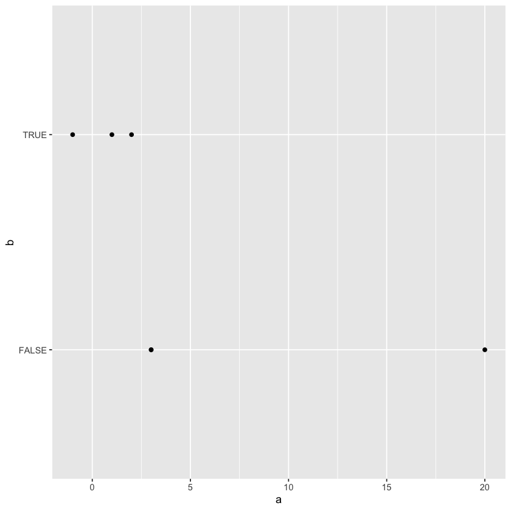

# Lecture 1: Preliminaries

## R and RStudio

`R` is a statistical computing environment:

- open source and free software for statistical computation and graphics and
- a computer language designed for typical statistical and graphical applications

`R` is an interpreted language:
You type some commands (via at terminal/command prompt or from a file called a script), and R processes those commands.

In this course, we will use `RStudio` to interact with `R`. `RStudio` is an integrated development environment, in other words user friendly software to interact with a language.

## How to install `R` and `RStudio`

You can install `R` from:  
[https://cran.r-project.org/ ]()

You can install `RStudio` from:  
[https://www.rstudio.com/products/rstudio/download/]()

Here's a webpage that explains the installation process in steps for different operating systems:  
[https://techvidvan.com/tutorials/install-r/]()

Here's a Youtube tutorial for MacOS:  
[https://www.youtube.com/watch?v=LanBozXJjOk&ab_channel=TomHenry-datasciencewithR]()

Here's a Youtube tutorial for Windows:  
[https://www.youtube.com/watch?v=TFGYlKvQEQ4&ab_channel=RProgramming-DDS]()

## Basic calculations in `R`

You can use `R` as a calculator and let it process a one line operation:

```R
1+2
```

3

Here's a tidy website that contains a list of useful operators:
https://www.learnbyexample.org/r-operators/

In this course, we'll be doing more complex computations and we'll need to save the result of a computation to be used later in some other computation. For that reason, we have *variables*. You can think of a variable as a keyword you chose to store a particular piece of information (numerical, or text or even logical).  

In `R`, there are two ways to assign a value to a variable:  
using `=` and using `<-`

First you type the name of the variable you chose, then you type `=` or `<-` and then you put what value you want to assign to that variable. That value can be the result of some calculation, can be the output of some function, it can be a number or text or logical value you want to store.

```R
# note that, when you make an assignment, you don't get an output. 
# if you're using RStudio, the variable and its value can be seen in the Environment pane
a = 3 ^ 2 #(example: exponentiation)
```

```R
# if you want R to return the value of a variable to the console, you'll need to type the name
a
```

9

```R
b <- 8 %/% 3 #(example: integer division)
```

```R
b
```

2

```R
# you can see the variables in RStudio in a nice, organized way in the Environment pane
# but if you want to see a list of variables in the Console:
ls()
```

<style>
.list-inline {list-style: none; margin:0; padding: 0}
.list-inline>li {display: inline-block}
.list-inline>li:not(:last-child)::after {content: "\00b7"; padding: 0 .5ex}
</style>

<ol class=list-inline><li>'a'</li><li>'b'</li></ol>

Note that `R` is case sensitive, for example `a` and `A` are treated as different variable names. 

```R
A = 7
```

```R
a
```

9

```R
A
```

7

If you want to update the value of a variable, you can do that of course.

```R
A = 10
```

```R
# now the value of A is not 7 anymore, but 10.
A
```

10

## Basic Data Types in `R`

Here's a nice reference for more on basic data types and data structures in `R`:  

https://swcarpentry.github.io/r-novice-inflammation/13-supp-data-structures/#:~:text=R's%20basic%20data%20types%20are,%2C%20data%20frame%2C%20and%20factors

There are 6 data types in `R`:

- character
- numeric (real or decimal)
- integer
- logical
- complex

You can find out the type of an object using the `typeof()` function. We'll discuss functions below, but basically they are self-contained algorithms built to perform a specific task. A function expects a user to give arguments as input and based on the values of the arguments, a function produces an output.

```R
# character values are anything that is to be treated as text
typeof("ab")
```

'character'

In the example above, we gave `"ab"` as the input to the function `typeof()` by typing `"ab"` between the parentheses, and the `typeof()` function returned us the type of `"ab"` as the output.

```R
# R will decide how to store the value unless you specify the data type manually
typeof(2)
```

'double'

(If you wonder why the word 'double', double just means a decimal number in double precision, i.e. two decimals after the decimal point.)

```R
# by using '' or "", we can tell R that we're using a characters
typeof('2')
```

'character'

You can store text in a variable as well. To store a text value, you'll need to use `"` or `'`. Otherwise, `R` thinks you're typing the name of a variable.

```R
# note the the ' signs between the " signs are treated as apostrophes:
mytext <- "I'm having a great 'day' today."
mytext
```

'I\'m having a great \'day\' today.'

The backslash before the apostrophe `\'` is `R`'s way of remembering that `'` sign is to be treated as an apostrophe, but not as a delimiter of some text data.  

```R
# the backslashes above are to denote escape sequences
# \' tells R to treat the apostrophe as a character
# to print nicely, you can use the cat() function
cat(mytext)
```

    I'm having a great 'day' today.

```R
typeof(2L) # the L on the right tells R to store 2 as an integer
```

'integer'

```R
typeof(-12.4)
```

'double'

```R
typeof(T)
```

'logical'

```R
typeof(FALSE)
```

'logical'

```R
typeof(1+4i)
```

'complex'

## Basic Data Structures in `R`

Data structures are ways to store (usually multiple) values together in a specific way.  
`R` has multiple data structures.  
The most important ones for us include:  

- atomic vector
- list
- matrix
- data frame
- factors

```R
# you can think of vectors as lists/arrays 
# that contain items of the same type
# the function c() below combines items to create vectors
vec1 <- c(1,2,3,20,3)
vec2 <- c(T,T,F,F,FALSE, TRUE)
vec3 <- c('a','stats', '614', "\'")
vec4 <- c(2L, -5L)
vec5 <- 1:10
```

```R
length(vec1)
```

5

```R
typeof(vec2)
```

'logical'

```R
typeof(vec3)
```

'character'

```R
cat(vec4)
```

    2 -5

```R
2*vec4
```

<style>
.list-inline {list-style: none; margin:0; padding: 0}
.list-inline>li {display: inline-block}
.list-inline>li:not(:last-child)::after {content: "\00b7"; padding: 0 .5ex}
</style>

<ol class=list-inline><li>4</li><li>-10</li></ol>

```R
vec5
```

<style>
.list-inline {list-style: none; margin:0; padding: 0}
.list-inline>li {display: inline-block}
.list-inline>li:not(:last-child)::after {content: "\00b7"; padding: 0 .5ex}
</style>

<ol class=list-inline><li>1</li><li>2</li><li>3</li><li>4</li><li>5</li><li>6</li><li>7</li><li>8</li><li>9</li><li>10</li></ol>

```R
vec6 <- vec5 - vec5
vec6
```

<style>
.list-inline {list-style: none; margin:0; padding: 0}
.list-inline>li {display: inline-block}
.list-inline>li:not(:last-child)::after {content: "\00b7"; padding: 0 .5ex}
</style>

<ol class=list-inline><li>0</li><li>0</li><li>0</li><li>0</li><li>0</li><li>0</li><li>0</li><li>0</li><li>0</li><li>0</li></ol>

```R
vec4 + vec6
```

<style>
.list-inline {list-style: none; margin:0; padding: 0}
.list-inline>li {display: inline-block}
.list-inline>li:not(:last-child)::after {content: "\00b7"; padding: 0 .5ex}
</style>

<ol class=list-inline><li>2</li><li>-5</li><li>2</li><li>-5</li><li>2</li><li>-5</li><li>2</li><li>-5</li><li>2</li><li>-5</li></ol>

```R
vec7 <- c(1,2,3)
typeof(vec7)
```

'double'

```R
vec8 <- c(1L,2L,3L)
typeof(vec8)
```

'integer'

```R
vec7 == vec8
```

<style>
.list-inline {list-style: none; margin:0; padding: 0}
.list-inline>li {display: inline-block}
.list-inline>li:not(:last-child)::after {content: "\00b7"; padding: 0 .5ex}
</style>

<ol class=list-inline><li>TRUE</li><li>TRUE</li><li>TRUE</li></ol>

```R
# rdocumentation.org/packages/utils/versions/3.6.2/topics/str
str(vec8)
```

     int [1:3] 1 2 3

### How to add a new element

```R
vec9 <- c(vec8,4L)
vec9
```

<style>
.list-inline {list-style: none; margin:0; padding: 0}
.list-inline>li {display: inline-block}
.list-inline>li:not(:last-child)::after {content: "\00b7"; padding: 0 .5ex}
</style>

<ol class=list-inline><li>1</li><li>2</li><li>3</li><li>4</li></ol>

```R
vec10 <- c(0L,vec9)
vec10
```

<style>
.list-inline {list-style: none; margin:0; padding: 0}
.list-inline>li {display: inline-block}
.list-inline>li:not(:last-child)::after {content: "\00b7"; padding: 0 .5ex}
</style>

<ol class=list-inline><li>0</li><li>1</li><li>2</li><li>3</li><li>4</li></ol>

### How to create vectors from a sequence of numbers

```R
vec11 <- 1:10
vec11
```

<style>
.list-inline {list-style: none; margin:0; padding: 0}
.list-inline>li {display: inline-block}
.list-inline>li:not(:last-child)::after {content: "\00b7"; padding: 0 .5ex}
</style>

<ol class=list-inline><li>1</li><li>2</li><li>3</li><li>4</li><li>5</li><li>6</li><li>7</li><li>8</li><li>9</li><li>10</li></ol>

```R
vec12 <- seq(from = 1, to = 2, by = 0.1)
vec12
```

<style>
.list-inline {list-style: none; margin:0; padding: 0}
.list-inline>li {display: inline-block}
.list-inline>li:not(:last-child)::after {content: "\00b7"; padding: 0 .5ex}
</style>

<ol class=list-inline><li>1</li><li>1.1</li><li>1.2</li><li>1.3</li><li>1.4</li><li>1.5</li><li>1.6</li><li>1.7</li><li>1.8</li><li>1.9</li><li>2</li></ol>

```R
vec12 <- seq(from = 1, to = 20)
vec12
```

<style>
.list-inline {list-style: none; margin:0; padding: 0}
.list-inline>li {display: inline-block}
.list-inline>li:not(:last-child)::after {content: "\00b7"; padding: 0 .5ex}
</style>

<ol class=list-inline><li>1</li><li>2</li><li>3</li><li>4</li><li>5</li><li>6</li><li>7</li><li>8</li><li>9</li><li>10</li><li>11</li><li>12</li><li>13</li><li>14</li><li>15</li><li>16</li><li>17</li><li>18</li><li>19</li><li>20</li></ol>

### Factors

Factors are categorical variables in `R`

```R
vec13 = as.factor(c("Male", "Female", "Male", "Female"))
vec13
```

<style>
.list-inline {list-style: none; margin:0; padding: 0}
.list-inline>li {display: inline-block}
.list-inline>li:not(:last-child)::after {content: "\00b7"; padding: 0 .5ex}
</style>

<ol class=list-inline><li>Male</li><li>Female</li><li>Male</li><li>Female</li></ol>

<details>
    <summary style=display:list-item;cursor:pointer>
        <strong>Levels</strong>:
    </summary>
    <style>
    .list-inline {list-style: none; margin:0; padding: 0}
    .list-inline>li {display: inline-block}
    .list-inline>li:not(:last-child)::after {content: "\00b7"; padding: 0 .5ex}
    </style>
    <ol class=list-inline><li>'Female'</li><li>'Male'</li></ol>
</details>

```R
# note that R automatically decides what the underlying data type is when creating a vector
# the items in a vector need to be of the same data type.
vec14 = c(1,TRUE,'A')
class(vec14)
```

'character'

### Lists

```R
# what if we want to store items of different data types and keep the data types as they are?
# we use lists
mylist <- list(1,TRUE,'A')
mylist
```

<ol>
    <li>1</li>
    <li>TRUE</li>
    <li>'A'</li>
</ol>

```R
typeof(mylist)
```

'list'

```R
mylist2 <- list(mylist, c(1,2,3))
mylist2
```

<ol>
    <li><ol>
    <li>1</li>
    <li>TRUE</li>
    <li>'A'</li>
</ol>
</li>
    <li><style>
.list-inline {list-style: none; margin:0; padding: 0}
.list-inline>li {display: inline-block}
.list-inline>li:not(:last-child)::after {content: "\00b7"; padding: 0 .5ex}
</style>
<ol class=list-inline><li>1</li><li>2</li><li>3</li></ol>
</li>
</ol>

```R
mylist3 <- c(mylist, c(1,2,3))
mylist3
```

<ol>
    <li>1</li>
    <li>TRUE</li>
    <li>'A'</li>
    <li>1</li>
    <li>2</li>
    <li>3</li>
</ol>

### Data Frames

You can think of *data frames* as lists of vectors of equal length.   
Or even better, like a spreadsheet.

```R
data.frame(vec1,vec2,vec3)
```

    Error in data.frame(vec1, vec2, vec3): arguments imply differing number of rows: 5, 6, 4
    Traceback:
    
    
    1. data.frame(vec1, vec2, vec3)
    
    2. stop(gettextf("arguments imply differing number of rows: %s", 
     .     paste(unique(nrows), collapse = ", ")), domain = NA)

```R
# since those vectors were of different lengths, R couldn't create a data frame.
cat(length(vec1),length(vec2),length(vec3))
```

    5 6 4

```R
vec15 <- c(vec1,-1)
```

```R
vec16 <- c('one', "two", vec3)
```

```R
cat(length(vec15),length(vec2),length(vec16))
```

    6 6 6

```R
data.frame(vec15,vec2,vec16)
```

<table class="dataframe">
<caption>A data.frame: 6 × 3</caption>
<thead>
    <tr><th scope=col>vec15</th><th scope=col>vec2</th><th scope=col>vec16</th></tr>
    <tr><th scope=col><dbl></th><th scope=col><lgl></th><th scope=col><chr></th></tr>
</thead>
<tbody>
    <tr><td> 1</td><td> TRUE</td><td>one  </td></tr>
    <tr><td> 2</td><td> TRUE</td><td>two  </td></tr>
    <tr><td> 3</td><td>FALSE</td><td>a    </td></tr>
    <tr><td>20</td><td>FALSE</td><td>stats</td></tr>
    <tr><td> 3</td><td>FALSE</td><td>614  </td></tr>
    <tr><td>-1</td><td> TRUE</td><td>'    </td></tr>
</tbody>
</table>

```R
df <- data.frame(a = vec15,b = vec2,c = vec16, d = vec2 + vec15)
df
```

<table class="dataframe">
<caption>A data.frame: 6 × 4</caption>
<thead>
    <tr><th scope=col>a</th><th scope=col>b</th><th scope=col>c</th><th scope=col>d</th></tr>
    <tr><th scope=col><dbl></th><th scope=col><lgl></th><th scope=col><chr></th><th scope=col><dbl></th></tr>
</thead>
<tbody>
    <tr><td> 1</td><td> TRUE</td><td>one  </td><td> 2</td></tr>
    <tr><td> 2</td><td> TRUE</td><td>two  </td><td> 3</td></tr>
    <tr><td> 3</td><td>FALSE</td><td>a    </td><td> 3</td></tr>
    <tr><td>20</td><td>FALSE</td><td>stats</td><td>20</td></tr>
    <tr><td> 3</td><td>FALSE</td><td>614  </td><td> 3</td></tr>
    <tr><td>-1</td><td> TRUE</td><td>'    </td><td> 0</td></tr>
</tbody>
</table>

### Matrices

```R
# the matrix function creates a matrix below that contains 3 rows and 2 columns
mymatrix = matrix(vec16, 3, 2)
mymatrix
```

<table class="dataframe">
<caption>A matrix: 3 × 2 of type chr</caption>
<tbody>
    <tr><td>one</td><td>stats</td></tr>
    <tr><td>two</td><td>614  </td></tr>
    <tr><td>a  </td><td>'    </td></tr>
</tbody>
</table>

```R
# finding the transpose matrix
t(mymatrix)
```

<table class="dataframe">
<caption>A matrix: 2 × 3 of type chr</caption>
<tbody>
    <tr><td>one  </td><td>two</td><td>a</td></tr>
    <tr><td>stats</td><td>614</td><td>'</td></tr>
</tbody>
</table>

## Indexing

```R
# how to grab the second value of a vector
vec3[2]
```

'stats'

```R
vec3
```

<style>
.list-inline {list-style: none; margin:0; padding: 0}
.list-inline>li {display: inline-block}
.list-inline>li:not(:last-child)::after {content: "\00b7"; padding: 0 .5ex}
</style>

<ol class=list-inline><li>'a'</li><li>'stats'</li><li>'614'</li><li>'\''</li></ol>

```R
1:3 #means all the numbers between 1 and 3 (1 and 3 included)
```

<style>
.list-inline {list-style: none; margin:0; padding: 0}
.list-inline>li {display: inline-block}
.list-inline>li:not(:last-child)::after {content: "\00b7"; padding: 0 .5ex}
</style>

<ol class=list-inline><li>1</li><li>2</li><li>3</li></ol>

```R
# what if we want more values
vec3[1:3]
```

<style>
.list-inline {list-style: none; margin:0; padding: 0}
.list-inline>li {display: inline-block}
.list-inline>li:not(:last-child)::after {content: "\00b7"; padding: 0 .5ex}
</style>

<ol class=list-inline><li>'a'</li><li>'stats'</li><li>'614'</li></ol>

```R
vec3[-1]
```

<style>
.list-inline {list-style: none; margin:0; padding: 0}
.list-inline>li {display: inline-block}
.list-inline>li:not(:last-child)::after {content: "\00b7"; padding: 0 .5ex}
</style>

<ol class=list-inline><li>'stats'</li><li>'614'</li><li>'\''</li></ol>

### Filtering using Boolean values

```R
length(vec3)
```

4

```R
vec3[c(T,T,F,T)]
```

<style>
.list-inline {list-style: none; margin:0; padding: 0}
.list-inline>li {display: inline-block}
.list-inline>li:not(:last-child)::after {content: "\00b7"; padding: 0 .5ex}
</style>

<ol class=list-inline><li>'a'</li><li>'stats'</li><li>'\''</li></ol>

```R
vec3[c(1,2,4)]
```

<style>
.list-inline {list-style: none; margin:0; padding: 0}
.list-inline>li {display: inline-block}
.list-inline>li:not(:last-child)::after {content: "\00b7"; padding: 0 .5ex}
</style>

<ol class=list-inline><li>'a'</li><li>'stats'</li><li>'\''</li></ol>

```R
vec3[5]
```

NA

```R
# similar with lists, but remember: you get sublists
mylist
```

<ol>
    <li>1</li>
    <li>TRUE</li>
    <li>'A'</li>
</ol>

```R
mylist[1:2]
```

<ol>
    <li>1</li>
    <li>TRUE</li>
</ol>

```R
mylist[1]
```

<ol>
    <li>1</li>
</ol>

```R
typeof(mylist[1])
```

'list'

```R
# to get the actual items
mylist[[1]]
```

1

```R
# giving names to items
mylist4 <- list("a" = vec1,
               "vec2" = vec2,
               namewithouthquotes = vec3,
               mynumber = 20,
               list(vec1, vec2, vec3), mean)
```

```R
mylist4
```

<dl>
    <dt>$a</dt>
        <dd><style>
.list-inline {list-style: none; margin:0; padding: 0}
.list-inline>li {display: inline-block}
.list-inline>li:not(:last-child)::after {content: "\00b7"; padding: 0 .5ex}
</style>
<ol class=list-inline><li>1</li><li>2</li><li>3</li><li>20</li><li>3</li></ol>
</dd>
    <dt>$vec2</dt>
        <dd><style>
.list-inline {list-style: none; margin:0; padding: 0}
.list-inline>li {display: inline-block}
.list-inline>li:not(:last-child)::after {content: "\00b7"; padding: 0 .5ex}
</style>
<ol class=list-inline><li>TRUE</li><li>TRUE</li><li>FALSE</li><li>FALSE</li><li>FALSE</li><li>TRUE</li></ol>
</dd>
    <dt>$namewithouthquotes</dt>
        <dd><style>
.list-inline {list-style: none; margin:0; padding: 0}
.list-inline>li {display: inline-block}
.list-inline>li:not(:last-child)::after {content: "\00b7"; padding: 0 .5ex}
</style>
<ol class=list-inline><li>'a'</li><li>'stats'</li><li>'614'</li><li>'\''</li></ol>
</dd>
    <dt>$mynumber</dt>
        <dd>20</dd>
    <dt>[[5]]</dt>
        <dd><ol>
    <li><style>
.list-inline {list-style: none; margin:0; padding: 0}
.list-inline>li {display: inline-block}
.list-inline>li:not(:last-child)::after {content: "\00b7"; padding: 0 .5ex}
</style>
<ol class=list-inline><li>1</li><li>2</li><li>3</li><li>20</li><li>3</li></ol>
</li>
    <li><style>
.list-inline {list-style: none; margin:0; padding: 0}
.list-inline>li {display: inline-block}
.list-inline>li:not(:last-child)::after {content: "\00b7"; padding: 0 .5ex}
</style>
<ol class=list-inline><li>TRUE</li><li>TRUE</li><li>FALSE</li><li>FALSE</li><li>FALSE</li><li>TRUE</li></ol>
</li>
    <li><style>
.list-inline {list-style: none; margin:0; padding: 0}
.list-inline>li {display: inline-block}
.list-inline>li:not(:last-child)::after {content: "\00b7"; padding: 0 .5ex}
</style>
<ol class=list-inline><li>'a'</li><li>'stats'</li><li>'614'</li><li>'\''</li></ol>
</li>
</ol>
</dd>
    <dt>[[6]]</dt>
        <dd><pre class=language-r><code>function (x, ...) 
UseMethod("mean")</code></pre></dd>
</dl>

```R
# we gave names to items in the list
names(mylist4)
```

<style>
.list-inline {list-style: none; margin:0; padding: 0}
.list-inline>li {display: inline-block}
.list-inline>li:not(:last-child)::after {content: "\00b7"; padding: 0 .5ex}
</style>

<ol class=list-inline><li>'a'</li><li>'vec2'</li><li>'namewithouthquotes'</li><li>'mynumber'</li><li>''</li><li>''</li></ol>

```R
mylist4[1]
```

<strong>$a</strong> = <style>
.list-inline {list-style: none; margin:0; padding: 0}
.list-inline>li {display: inline-block}
.list-inline>li:not(:last-child)::after {content: "\00b7"; padding: 0 .5ex}
</style>

<ol class=list-inline><li>1</li><li>2</li><li>3</li><li>20</li><li>3</li></ol>

```R
mylist4["a"]
```

<strong>$a</strong> = <style>
.list-inline {list-style: none; margin:0; padding: 0}
.list-inline>li {display: inline-block}
.list-inline>li:not(:last-child)::after {content: "\00b7"; padding: 0 .5ex}
</style>

<ol class=list-inline><li>1</li><li>2</li><li>3</li><li>20</li><li>3</li></ol>

### Slicing/indexing data frames

```R
df
```

<table class="dataframe">
<caption>A data.frame: 6 × 4</caption>
<thead>
    <tr><th scope=col>a</th><th scope=col>b</th><th scope=col>c</th><th scope=col>d</th></tr>
    <tr><th scope=col><dbl></th><th scope=col><lgl></th><th scope=col><chr></th><th scope=col><dbl></th></tr>
</thead>
<tbody>
    <tr><td> 1</td><td> TRUE</td><td>one  </td><td> 2</td></tr>
    <tr><td> 2</td><td> TRUE</td><td>two  </td><td> 3</td></tr>
    <tr><td> 3</td><td>FALSE</td><td>a    </td><td> 3</td></tr>
    <tr><td>20</td><td>FALSE</td><td>stats</td><td>20</td></tr>
    <tr><td> 3</td><td>FALSE</td><td>614  </td><td> 3</td></tr>
    <tr><td>-1</td><td> TRUE</td><td>'    </td><td> 0</td></tr>
</tbody>
</table>

```R
df$a
```

<style>
.list-inline {list-style: none; margin:0; padding: 0}
.list-inline>li {display: inline-block}
.list-inline>li:not(:last-child)::after {content: "\00b7"; padding: 0 .5ex}
</style>

<ol class=list-inline><li>1</li><li>2</li><li>3</li><li>20</li><li>3</li><li>-1</li></ol>

```R
df["a"]
```

<table class="dataframe">
<caption>A data.frame: 6 × 1</caption>
<thead>
    <tr><th scope=col>a</th></tr>
    <tr><th scope=col><dbl></th></tr>
</thead>
<tbody>
    <tr><td> 1</td></tr>
    <tr><td> 2</td></tr>
    <tr><td> 3</td></tr>
    <tr><td>20</td></tr>
    <tr><td> 3</td></tr>
    <tr><td>-1</td></tr>
</tbody>
</table>

```R
df[["a"]]
```

<style>
.list-inline {list-style: none; margin:0; padding: 0}
.list-inline>li {display: inline-block}
.list-inline>li:not(:last-child)::after {content: "\00b7"; padding: 0 .5ex}
</style>

<ol class=list-inline><li>1</li><li>2</li><li>3</li><li>20</li><li>3</li><li>-1</li></ol>

```R
df[[1]]
```

<style>
.list-inline {list-style: none; margin:0; padding: 0}
.list-inline>li {display: inline-block}
.list-inline>li:not(:last-child)::after {content: "\00b7"; padding: 0 .5ex}
</style>

<ol class=list-inline><li>1</li><li>2</li><li>3</li><li>20</li><li>3</li><li>-1</li></ol>

```R
df[1][4]
```

    Error in `[.data.frame`(df[1], 4): undefined columns selected
    Traceback:
    
    
    1. df[1][4]
    
    2. `[.data.frame`(df[1], 4)
    
    3. stop("undefined columns selected")

```R
# 1st column 4th row
df[[1]][4]
```

20

```R
df[[1]][4:6]
```

<style>
.list-inline {list-style: none; margin:0; padding: 0}
.list-inline>li {display: inline-block}
.list-inline>li:not(:last-child)::after {content: "\00b7"; padding: 0 .5ex}
</style>

<ol class=list-inline><li>20</li><li>3</li><li>-1</li></ol>

```R
# first row 4th column
df[1,4]
```

2

```R
df[4,1]
```

20

```R
df[1,]
```

<table class="dataframe">
<caption>A data.frame: 1 × 4</caption>
<thead>
    <tr><th></th><th scope=col>a</th><th scope=col>b</th><th scope=col>c</th><th scope=col>d</th></tr>
    <tr><th></th><th scope=col><dbl></th><th scope=col><lgl></th><th scope=col><chr></th><th scope=col><dbl></th></tr>
</thead>
<tbody>
    <tr><th scope=row>1</th><td>1</td><td>TRUE</td><td>one</td><td>2</td></tr>
</tbody>
</table>

```R
df[c(1,2,4),]
```

<table class="dataframe">
<caption>A data.frame: 3 × 4</caption>
<thead>
    <tr><th></th><th scope=col>a</th><th scope=col>b</th><th scope=col>c</th><th scope=col>d</th></tr>
    <tr><th></th><th scope=col><dbl></th><th scope=col><lgl></th><th scope=col><chr></th><th scope=col><dbl></th></tr>
</thead>
<tbody>
    <tr><th scope=row>1</th><td> 1</td><td> TRUE</td><td>one  </td><td> 2</td></tr>
    <tr><th scope=row>2</th><td> 2</td><td> TRUE</td><td>two  </td><td> 3</td></tr>
    <tr><th scope=row>4</th><td>20</td><td>FALSE</td><td>stats</td><td>20</td></tr>
</tbody>
</table>

```R
mymatrix
```

<table class="dataframe">
<caption>A matrix: 3 × 2 of type chr</caption>
<tbody>
    <tr><td>one</td><td>stats</td></tr>
    <tr><td>two</td><td>614  </td></tr>
    <tr><td>a  </td><td>'    </td></tr>
</tbody>
</table>

```R
mymatrix[1,2]
```

'stats'

## Functions

```R
new_sum <- function(value1, value2){
    results <- value1 + value2
    return(results)
}
```

```R
new_sum(2,4)
```

6

```R
new_division <- function(x,y){
    return(y/x)
}
```

```R
new_division(5,4)
```

0.8

```R
new_division(y=4,x=5)
```

0.8

```R
new_division
```

<pre class=language-r><code>function (x, y) 
{
<span style=white-space:pre-wrap>    return(y/x)</span>
}</code></pre>

```R
?mean
```

## Packages

```R
# installing a library
install.packages("ggplot2")
```

    Updating HTML index of packages in '.Library'
    
    Making 'packages.html' ...
     done

```R
# importing a library
library(ggplot2)
```

```R
# once you import a library, you can call any function from that library
ggplot(df, aes(a,b)) + geom_point()
```



```R

```
